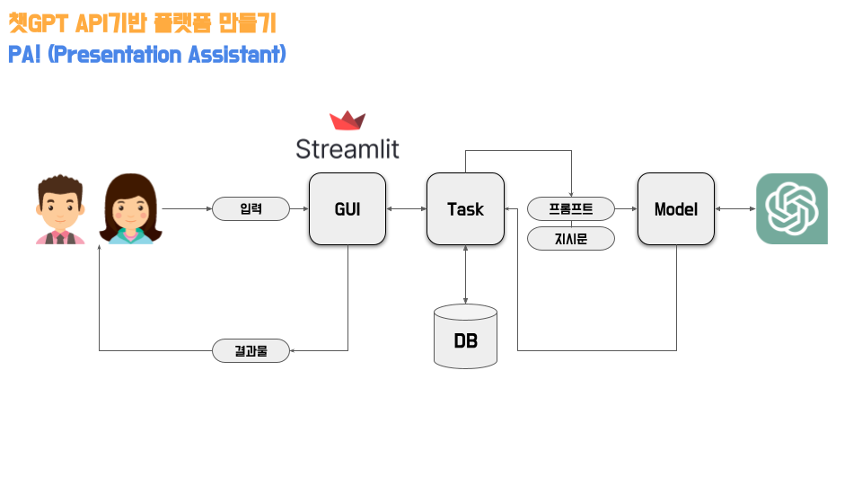
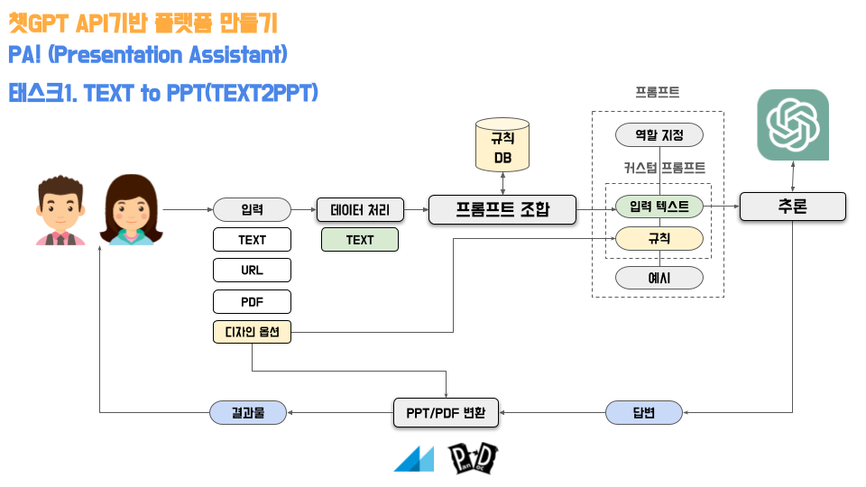
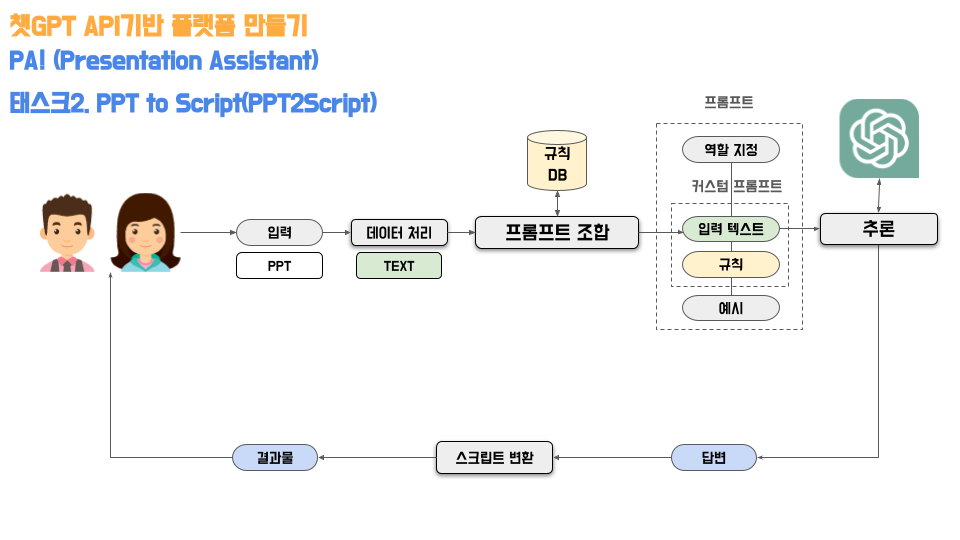
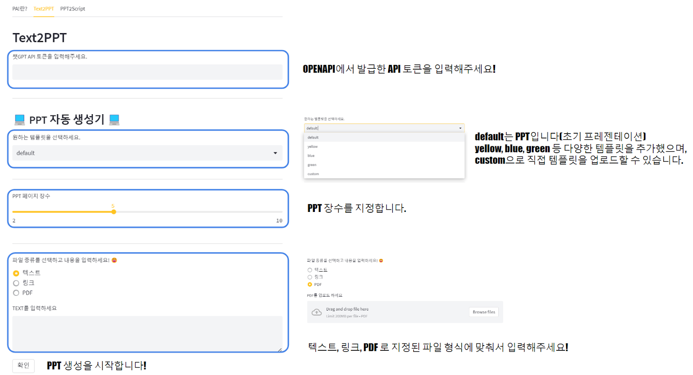
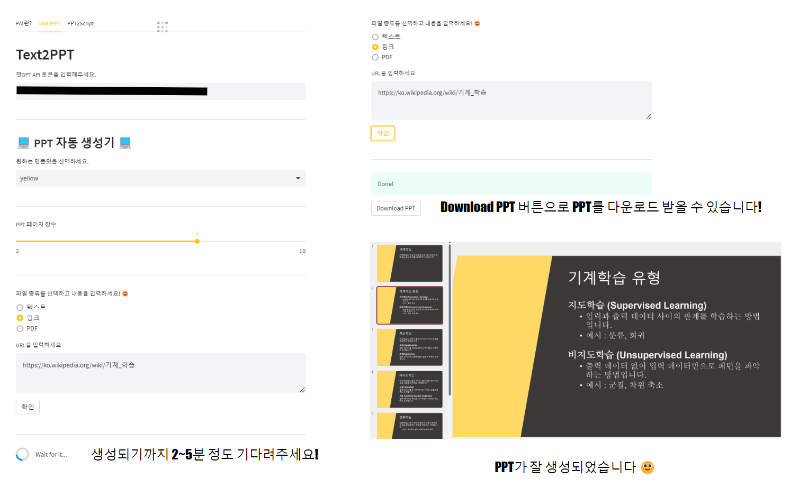
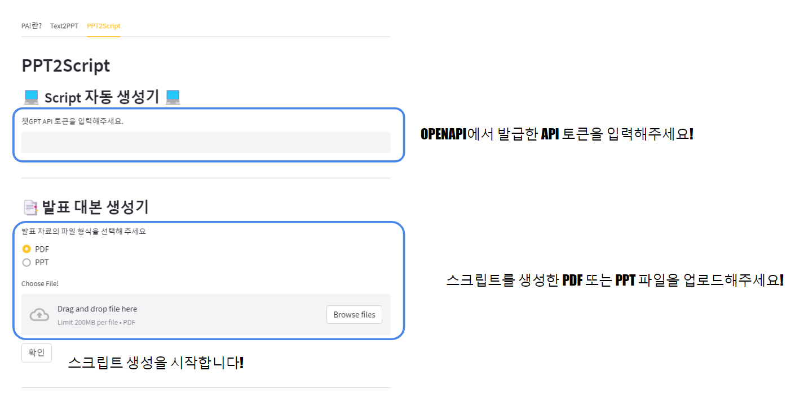

# PPT 및 스크립트 생성 서비스
> PA!(Presentation Assistant) v1.0.0 - Text2PPT & PPT2Script 서비스

## [PA!(Presentation Assistant)](https://huggingface.co/spaces/SRankChatGpt/Presentation-Assistant)
> 파!🥬 PA! (Presentation Assistant)는 PPT 제작 및 프레젠테이션 지원 Text2PPT & PPT2Script 서비스입니다.   
사용자가 입력한 내용을 기반으로 PPT를 제작하고, 프레젠테이션 스크립트를 제공하여 프레젠테이션 역량을 향상시킵니다.   
자동화된 PPT 제작 기능을 통해 업무 효율성을 높이고, 시간과 비용을 절약할 수 있습니다.   

※ [Colab 노트북 코드](PA(Presentation_Assistant).ipynb)    
 → 해당 코드는 노트북 상에서 작동되는 서비스로 본 서비스와 코드는 [PA!(Presentation Assistant)](https://huggingface.co/spaces/SRankChatGpt/Presentation-Assistant)에서 체험하실 수 있습니다 😀

# 1. 서비스 방식
## 1-1. 전체 서비스 프로세스
- OpenAI API - HuggingFace 기반 프로토타입

## 1-2. PPT 제작 서비스(TEXT2PPT)

## 1-3. 발표 대본 작성 서비스(PPT2Script)

# 2. 서비스 가이드
## TEXT2PPT

---

## PPT2Script

---

> 서비스 관련 문의는 Github Issue 및 Huggingface Community로 부탁드립니다!    
피드백 및 버그 신고는 언제나 환영입니다 😄